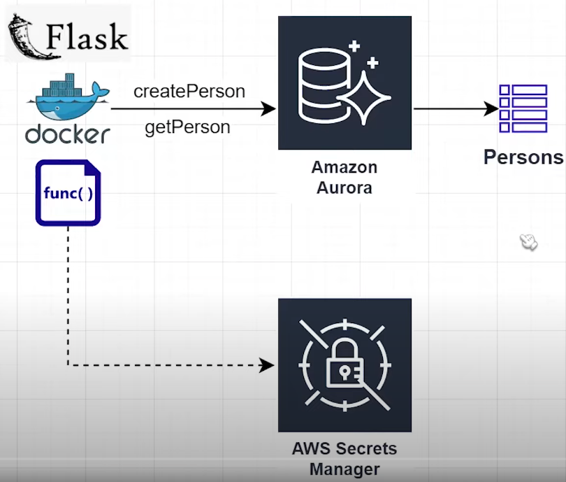
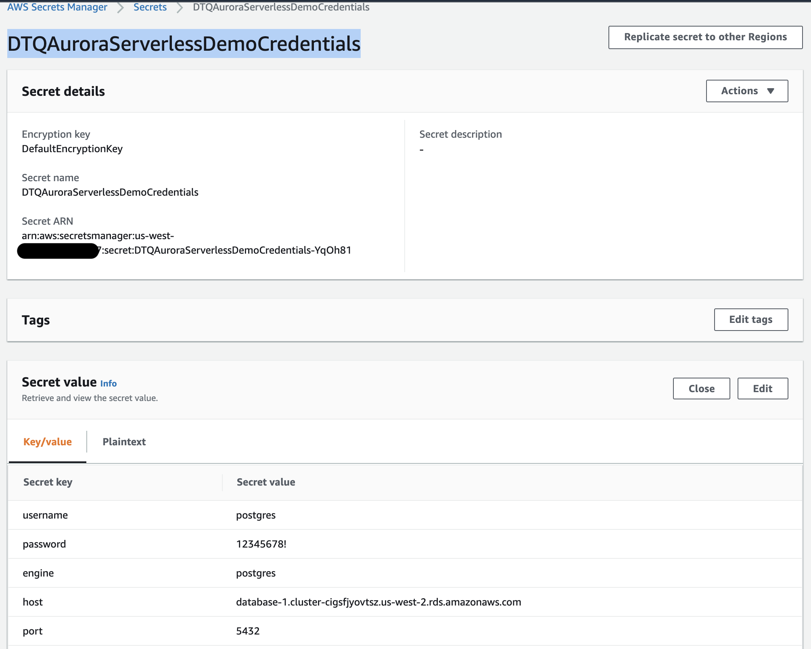
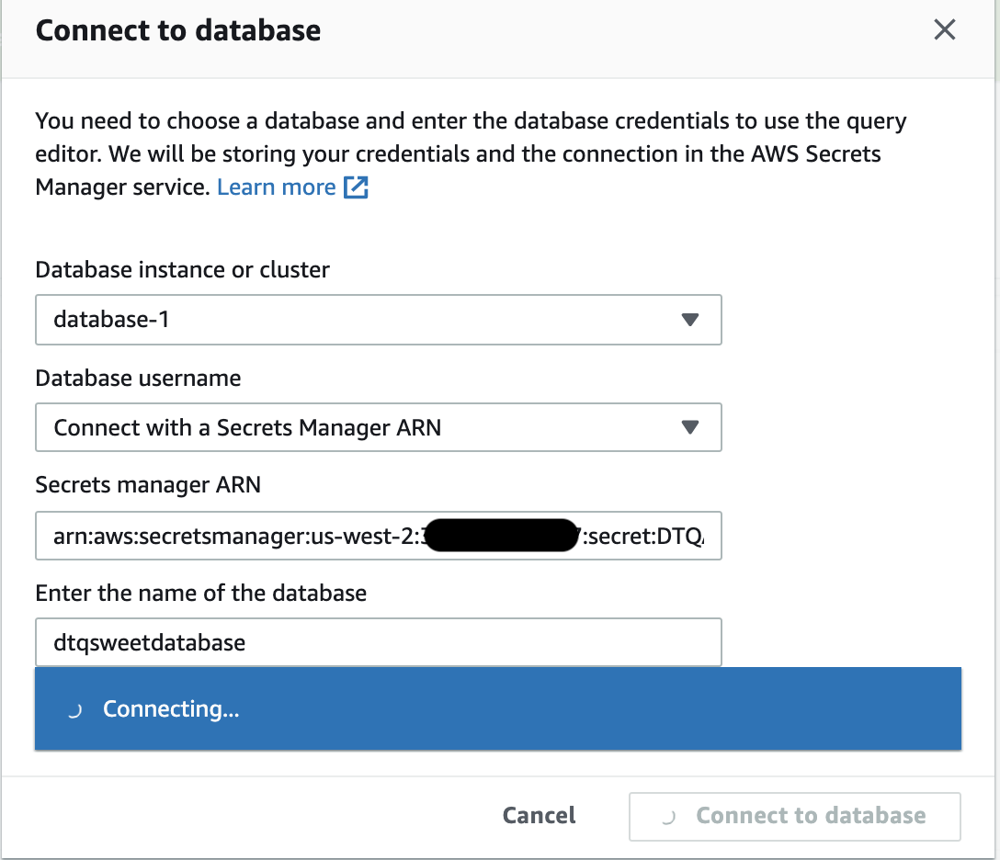
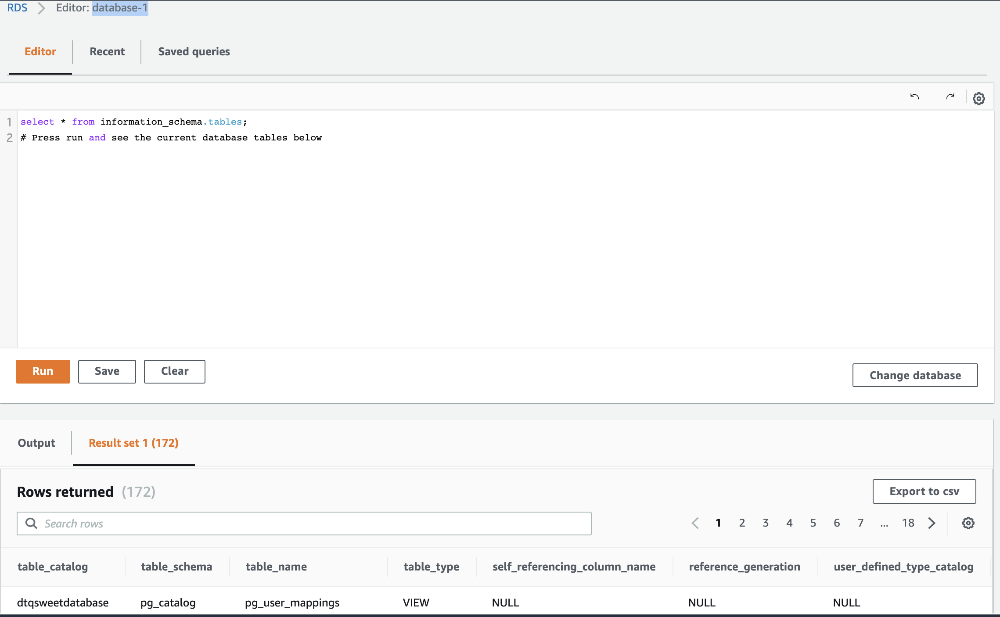
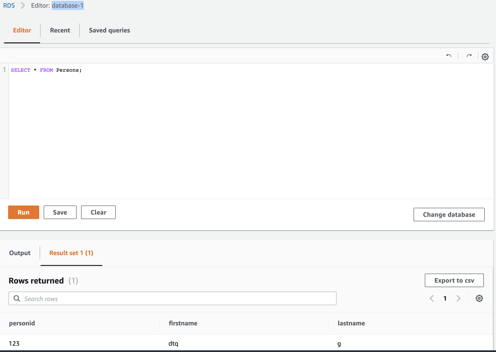
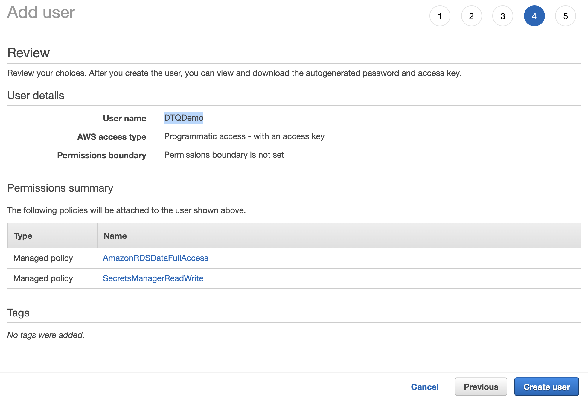
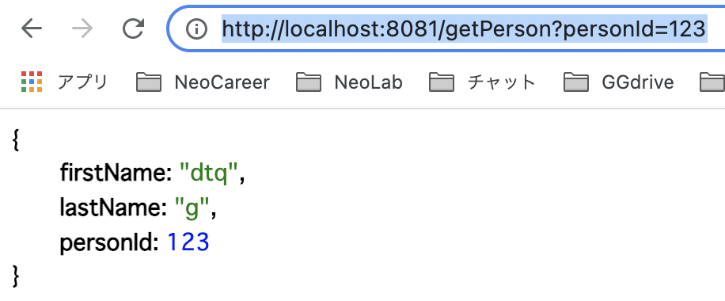
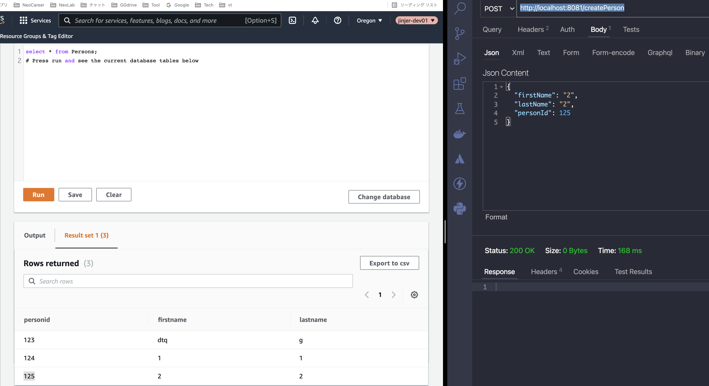

# aws-aurora-ssm-flask-apidemo 🐳


[](https://github.com/tquangdo/aws-aurora-ssm-flask-apidemo/issues/new)



## reference
[youtube](https://www.youtube.com/watch?v=NM4Vd7fpZWk&t=1s)

## rds aurora
+ Edition = `postgres`
+ Capacity type = `serverless`
+ set PW = `12345678!`
+ Capacity settings: check `Scale the capacity to 0 ACUs when cluster is idle` to save money
+ Web Service Data API: check `data API`
+ Initial database name = `dtqsweetdatabase`
+ Enable deletion protection:
1. DEV/STG: uncheck
2. PROD: check

## secrets manager
+ click `store a new secret`
+ Secret type = `credentials for Amazon RDS db`
+ user name = `postgres` & PW = `12345678!`
+ DB instance: click `database-1`
+ Secret name = `DTQAuroraServerlessDemoCredentials`


## rds aurora
+ click `Query Editor`, select `Secrets manager ARN`

+

+ create `Persons`
```sql
create table Persons (
  personId serial PRIMARY KEY,
  firstName varchar (50) not null,
  lastName varchar (50) not null 
);
```
+ insert 1 rec
```sql
INSERT INTO Persons(personId, firstName, lastName) VALUES ('123', 'dtq', 'g');
```
+ select


## IAM user
+ create user `DTQDemo`


## local docker deploy
+ `app.py`:
1. replace 'TODO' with `DTQDemo`'s access key
```py
rds_data = boto3.client('rds-data', config=my_config, aws_access_key_id='TODO', aws_secret_access_key='TODO')
```
2. replace `aurora_db_name`, `aurora_cluster_arn` & `aurora_secret_arn`
+ run cmd
```shell
# docker build -t flask-app .
# docker run -d -p 8081:8081 flask-app
# docker ps                           
CONTAINER ID   IMAGE       COMMAND              CREATED         STATUS         PORTS                                       NAMES
f70959213528   flask-app   "python -u app.py"   3 minutes ago   Up 3 minutes   0.0.0.0:8081->8081/tcp, :::8081->8081/tcp   laughing_mcnulty
```
+ run API GET: `http://localhost:8081/getPerson?personId=123`

+ run API POST: `http://localhost:8081/createPerson`

